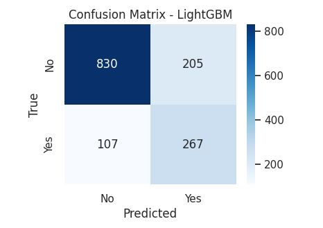

# 🚀 Customer Churn Prediction – End-to-End ML Pipeline

[](https://www.python.org/)
[](LICENSE)
[](https://scikit-learn.org/)
[](https://xgboost.ai/)
[](https://lightgbm.readthedocs.io/)
[](https://catboost.ai/)

---

## 📖 Overview

This project delivers a **production-ready, end-to-end Machine Learning pipeline** for predicting customer churn using the popular **Telco Customer Churn** dataset. It covers the entire ML lifecycle:

- Data loading & cleaning  
- Advanced feature engineering  
- Handling class imbalance with **SMOTE**  
- Training & tuning 5 different classifiers via **RandomizedSearchCV**  
- Comprehensive evaluation (AUC-ROC, F1-score, accuracy)  
- Model persistence and inference simulation for new customers  

The pipeline is designed to be **robust, reproducible, and easily deployable** in real-world environments.

---

## 📊 Dataset

- **Source:** [Telco Customer Churn on Kaggle](https://www.kaggle.com/datasets/blastchar/telco-customer-churn)  
- **Size:** 7,043 customers, 21 raw features  
- **Target variable:** `Churn` (Yes/No → 1/0)  
- **Class distribution:** 73.5% Non‑Churn, 26.5% Churn (imbalanced)

---

## ⚙️ Pipeline Steps

### 1. Data Cleaning
- Convert `TotalCharges` to numeric, impute missing values with median.
- Map `Churn` to binary (1 for Yes, 0 for No).
- Drop non‑predictive `customerID`.

### 2. Feature Engineering (Basic & Advanced)

| Feature | Description |
|---------|-------------|
| `AvgMonthlyCharge` | TotalCharges / tenure |
| `tenure_sq` | Tenure squared |
| `MonthlyCharges_sq` | MonthlyCharges squared |
| `SeniorCitizen_MonthlyCharges` | Interaction term |
| `SeniorCitizen_tenure` | Interaction term |
| `InternetService_Contract` | Concatenation of InternetService and Contract |
| `MonthlyCharges_tenure` | Product of monthly charges and tenure |
| `tenure_group` | Binned tenure (0‑24m, 25‑48m, 49+m) |

### 3. Train / Test Split
- 80% training, 20% testing with **stratification** to preserve class ratio.

### 4. Preprocessing Pipeline
- **Numerical features:** median imputation + standard scaling  
- **Categorical features:** constant imputation + one‑hot encoding  

### 5. Handling Class Imbalance
- **SMOTE (Synthetic Minority Oversampling Technique)** applied inside an `ImbPipeline` to avoid data leakage during cross‑validation.

### 6. Model Training & Hyperparameter Tuning
Five models were trained using `RandomizedSearchCV` (50 iterations, 5‑fold Stratified K‑Fold, scoring = ROC‑AUC):

- Logistic Regression  
- Random Forest  
- XGBoost  
- LightGBM  
- CatBoost  

### 7. Model Evaluation
- Metrics: Accuracy, F1‑score, AUC‑ROC, classification report, confusion matrix.

### 8. Model Persistence & Inference
- Best model saved with `joblib`.  
- A **new customer** scenario is simulated: feature engineering is reapplied, and the model outputs churn probability + prediction.

---

## 🏆 Results (Test Set)

| Model                | Accuracy | F1‑Score | AUC‑ROC |
|----------------------|----------|----------|---------|
| Logistic Regression  | 0.7452   | 0.6201   | 0.8434  |
| Random Forest        | 0.7679   | 0.6166   | 0.8420  |
| XGBoost              | 0.7743   | 0.6223   | 0.8435  |
| **LightGBM (Winner)**| **0.7786** | **0.6312** | **0.8438** |
| CatBoost             | 0.7814   | 0.6244   | 0.8430  |

**LightGBM** achieved the highest AUC‑ROC (0.8438) and is saved as the final model.

### Detailed Classification Report (LightGBM)

```
              precision    recall  f1-score   support
No Churn          0.89      0.80      0.84      1035
Churn             0.57      0.71      0.63       374

Accuracy: 0.7786
Macro avg: 0.73      0.76      0.74
Weighted avg: 0.80   0.78      0.79
```
 



---

## 💾 Model Usage (Inference Example)

```python
import joblib
import pandas as pd
import numpy as np

# Load the saved pipeline
model = joblib.load('churn_pipeline_final.joblib')

# New customer data (raw format)
new_customer = pd.DataFrame([{
    'gender': 'Female', 'SeniorCitizen': 0, 'Partner': 'Yes', 'Dependents': 'No',
    'tenure': 12, 'PhoneService': 'Yes', 'MultipleLines': 'No',
    'InternetService': 'Fiber optic', 'OnlineSecurity': 'No', 'OnlineBackup': 'Yes',
    'DeviceProtection': 'No', 'TechSupport': 'No', 'StreamingTV': 'Yes',
    'StreamingMovies': 'No', 'Contract': 'Month-to-month', 'PaperlessBilling': 'Yes',
    'PaymentMethod': 'Electronic check', 'MonthlyCharges': 85.5, 'TotalCharges': 1025.75
}])

# Apply the same feature engineering (must be identical to training)
new_customer['AvgMonthlyCharge'] = new_customer['TotalCharges'] / new_customer['tenure']
new_customer['AvgMonthlyCharge'].replace([np.inf, -np.inf], np.nan, inplace=True)
new_customer['tenure_sq'] = new_customer['tenure']**2
new_customer['MonthlyCharges_sq'] = new_customer['MonthlyCharges']**2
new_customer['SeniorCitizen_MonthlyCharges'] = new_customer['SeniorCitizen'] * new_customer['MonthlyCharges']
new_customer['SeniorCitizen_tenure'] = new_customer['SeniorCitizen'] * new_customer['tenure']
new_customer['InternetService_Contract'] = new_customer['InternetService'].astype(str) + '_' + new_customer['Contract'].astype(str)
new_customer['MonthlyCharges_tenure'] = new_customer['MonthlyCharges'] * new_customer['tenure']
bins = [0, 24, 48, 73]
labels = ['Short-term (0-24m)', 'Medium-term (25-48m)', 'Long-term (49+m)']
new_customer['tenure_group'] = pd.cut(new_customer['tenure'], bins=bins, labels=labels, right=False, include_lowest=True)

# Predict
pred = model.predict(new_customer)
proba = model.predict_proba(new_customer)[0][1]

print(f"Churn Probability: {proba:.2%}")
print(f"Predicted Churn: {'Yes' if pred[0]==1 else 'No'}")
```

**Example output:**  
```
Churn Probability: 78.60%
Predicted Churn: Yes
```

---

## 🛠️ Requirements

- Python 3.8 or higher  
- Libraries listed in `requirements.txt` (see below)

### `requirements.txt`

```
pandas>=1.5.0
numpy>=1.23.0
matplotlib>=3.6.0
seaborn>=0.12.0
scikit-learn>=1.2.0
imbalanced-learn>=0.10.0
xgboost>=1.7.0
lightgbm>=3.3.0
catboost>=1.1.0
joblib>=1.2.0
scipy>=1.9.0
```

Install all dependencies with:

```bash
pip install -r requirements.txt
```

---

## 📁 Repository Structure

```
.
├── Task_2_End_to_End_ML_Pipeline.ipynb   # Main notebook with full pipeline
├── churn_pipeline_final.joblib           # Saved best model (LightGBM)
├── requirements.txt                      # Python dependencies
├── README.md                             # This file
└── images/                               # (Optional) folder for plots
    └── confusion_matrix_lightgbm.png
```

---

## 🧪 How to Run

1. **Clone the repository**  
   ```bash
   git clone https://github.com/noorrami/churn_prediction_pipeline_NRS.git
   cd churn_prediction_pipeline_NRS
   ```

2. **Install dependencies**  
   ```bash
   pip install -r requirements.txt
   ```

3. **Run the Jupyter notebook**  
   ```bash
   jupyter notebook Task_2_End_to_End_ML_Pipeline.ipynb
   ```

   Execute cells sequentially, or directly use the saved model for predictions.

---

## 📌 Key Technical Highlights

- **ImbPipeline + SMOTE** ensures synthetic sampling is correctly applied only on training folds during cross‑validation, preventing data leakage.  
- **RandomizedSearchCV** with `loguniform` and `randint` distributions explores hyperparameters efficiently.  
- **Advanced feature engineering** creates interaction terms and polynomial features that improve model discrimination.  
- The final pipeline includes both preprocessing and SMOTE, making it self‑contained and deployment‑ready.

---

## 👩‍💻 Author

**Noor R Saad**  
Date: 2026-05-23  
GitHub: [noorrami](https://github.com/noorrami)  
Project Repository: [churn_prediction_pipeline_NRS](https://github.com/noorrami/churn_prediction_pipeline_NRS)

---

## 📜 License

This project is licensed under the **MIT License** – see the [LICENSE](LICENSE) file for details.

---

## ✅ Conclusion

This project demonstrates a **complete, production‑grade ML pipeline** for customer churn prediction. It incorporates best practices: data cleaning, advanced feature engineering, handling imbalanced data with SMOTE, hyperparameter tuning across multiple algorithms, rigorous evaluation, and model persistence. **LightGBM** emerged as the best model with an AUC‑ROC of **0.8438**. The pipeline can be directly adapted to real‑world churn prediction systems.
